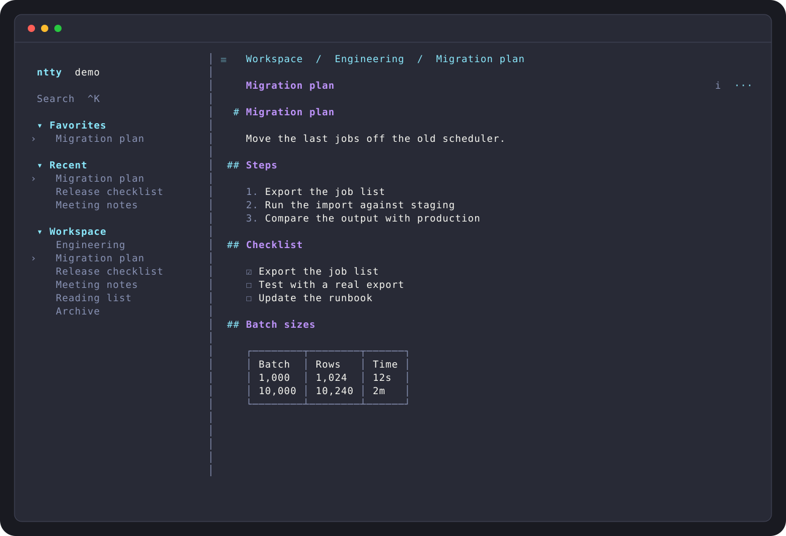
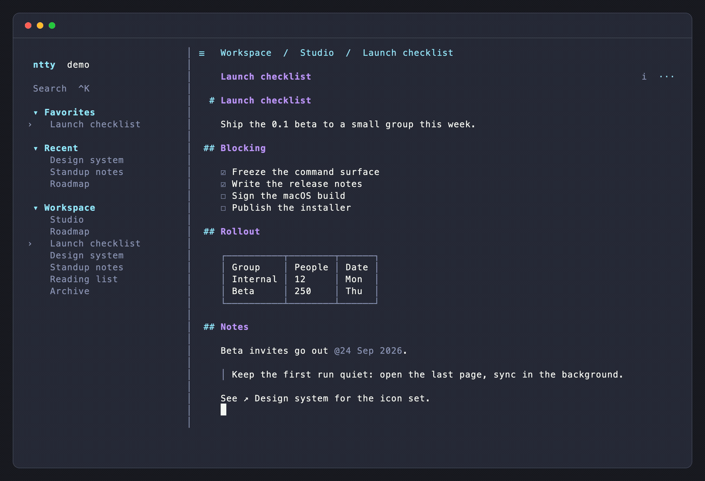
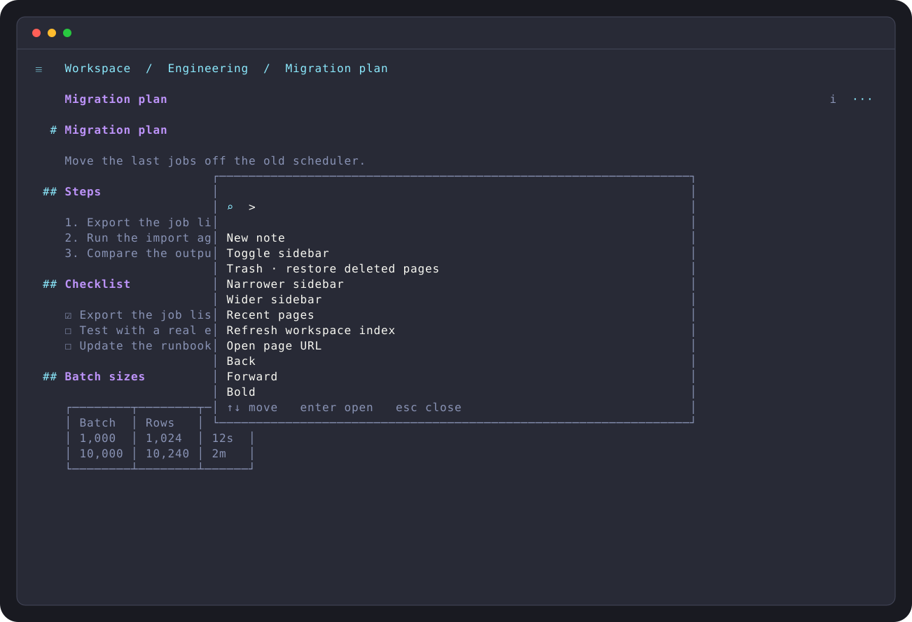

# ntty


Notion in a terminal (`tty`): one editable document, a page sidebar, and
bidirectional sync. Uses the official Notion CLI (`ntn`) for authentication
and API access.





Screenshots and recordings are captured from the real interface with fictional
demo content (the GIF is 2x downscaled; `docs/media/ntty-demo.mp4` is sharper).

## Features

- Rich text editing: headings, lists, tasks, quotes, inline tables, and code.
  Markdown is preserved exactly for Notion.
- `/` block commands and `@` mentions for pages, people, and dates.
- Mouse support: click and drag to select, wheel scrolling, right-click menus.
- Sidebar with favourites, recents, and an expandable page tree.
- Local drafts, undo/redo, and revision snapshots (`Ctrl+R`).
- Autosave after 3 seconds idle, with remote refresh for clean pages.
- Read-only database views: table, board, list, and gallery. Saved Notion
  views keep their server-side filters and sorts.
- Page management: rename, favourite, move to Trash, and restore.



## Install

macOS and Linux (amd64 and arm64) get prebuilt binaries:

```sh
curl -fsSL https://raw.githubusercontent.com/netapy/ntty/main/install.sh | sh
```

This downloads the latest release, verifies its SHA-256 checksum, and installs
to `~/.local/bin/ntty`. Set `NTTY_INSTALL_DIR` to choose another directory.

ntty calls the [Notion CLI](https://ntn.dev) for authentication, so install
and sign in to `ntn` first:

```sh
ntn login
ntty
```

### Upgrade

```sh
ntty upgrade          # download and replace the running binary
ntty upgrade --check  # only report whether a newer release exists
```

`ntty upgrade` uses the same release artifacts and checksum verification as the
installer.

### From source

Requires Go 1.24+:

```sh
git clone https://github.com/netapy/ntty.git
cd ntty
make install
```

### Try it without an account

```sh
ntty --demo
```

### Startup options

```sh
ntty --check                    # Read-only connection check
ntty --profile work             # Separate local cache and drafts
ntty --parent page:<uuid>       # Default parent for new notes
ntty --data-dir /path/to/data   # Choose a storage directory
```

Profiles isolate local data; they do not switch the account authenticated in `ntn`.

## Keyboard and mouse

| Action | Shortcut |
| :--- | :--- |
| Find a page or command | `Ctrl+K` · type `>` for commands |
| Create a note | `Ctrl+N` |
| Insert a block / mention | `/` on an empty line · `@` |
| Toggle the sidebar | `Ctrl+\` · click `☰` |
| Save immediately | `Ctrl+S` |
| Undo / redo | `Ctrl+Z` / `Ctrl+Y` |
| Local revisions | `Ctrl+R` |
| Copy / cut / paste | `Ctrl+C` / `Ctrl+X` / `Ctrl+V` |
| Quit, retaining local drafts | `Ctrl+Q` |

Click to place the cursor, drag to select, and scroll the pane under the
pointer. Right-click a page, breadcrumb, title, or database row for its menu.
In a version comparison, use `←` / `→` or click a pane, then `Enter` to choose.

## Sync

Edits are saved locally before syncing. ntty uses Notion's enhanced Markdown
API, reads before writing, and sends targeted updates. Clean active pages
refresh automatically, and edits made during a save are rebased onto the
result.

Uncertain writes are reconciled before another write. If two versions cannot
be merged confidently, both are kept for comparison. Protected embeds stay
intact, and inline references can be removed without deleting their
destinations.

## Limitations

ntty is an independent client, not an official Notion product. The public API
sets the boundaries: database views are read-only, calendar and timeline-style
views fall back to tables, and some complex embeds remain atomic or need the
web app. Notion AI is not available.

See the [user guide](docs/guide.md) and [parity notes](NOTION-PARITY.md) for
details.

## Development

```sh
make build
go test ./...
go test -race -timeout 120s ./...
go vet ./...
```

Built with Go, [tview](https://github.com/rivo/tview),
[tcell](https://github.com/gdamore/tcell), and the official Notion CLI.

The README images are reproducible captures of the real TUI:

```sh
NTTY_SCREENSHOTS=1 go test . -run '^TestReadmeScreenshots$' -count=1
```

Issues and pull requests are welcome. Please use fictional content in examples.
